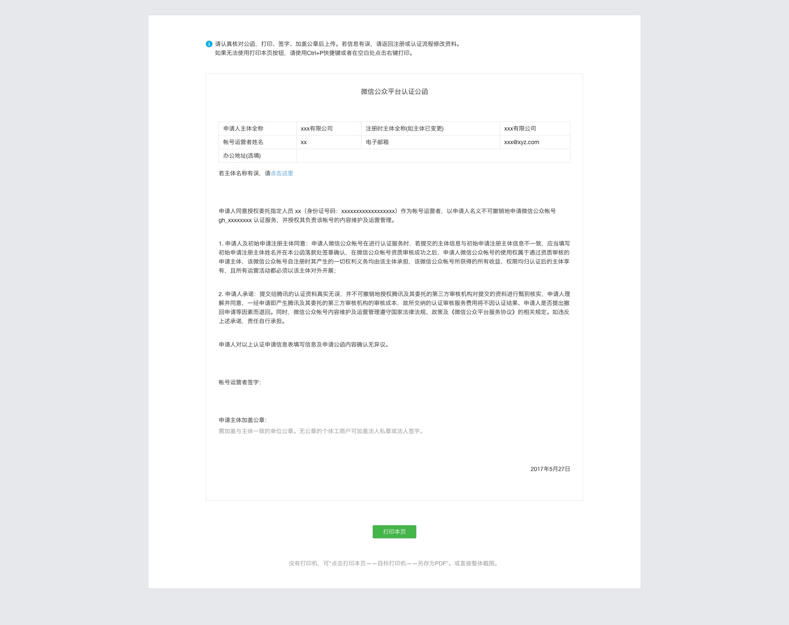
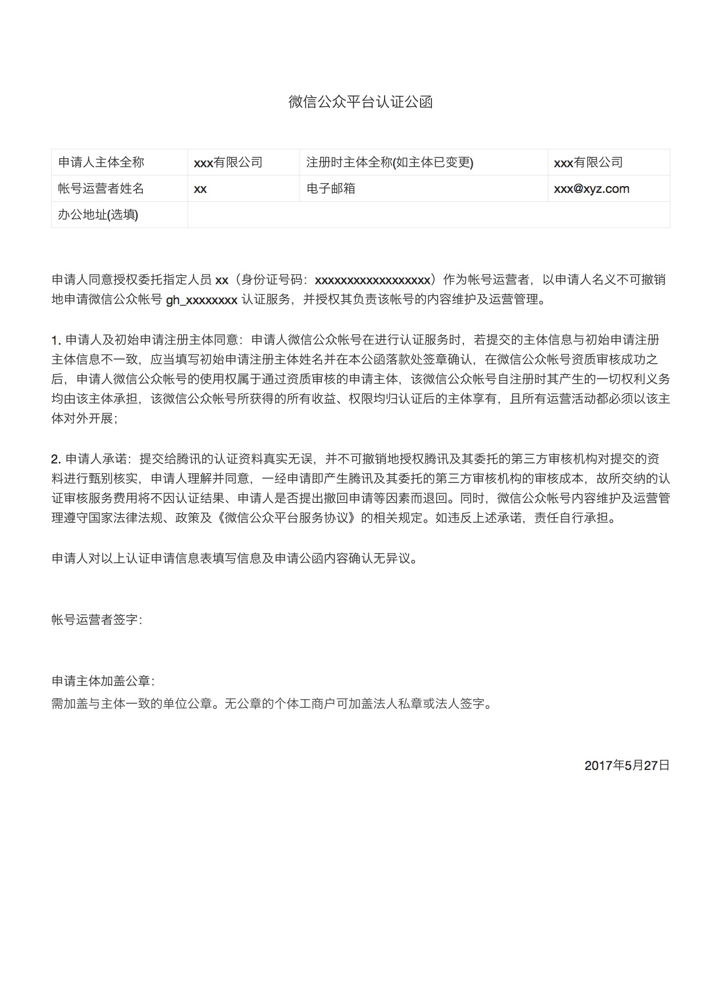

# 微信公众平台认证公函打印功能学习

觉得微信公众平台认证公函的打印功能体验很不错，就拿过来学习一下。

大家也可以访问 [demo](http://fanqi.github.io/wxverify-print/) 

## 技术要点

通过引入 `print.css` 样式，实现了网页显示和打印效果的差异化。

```
<link rel="stylesheet" media="print" href="css/print.css">
```

其中：

`media="print"` 为打印设备规定了不同的样式。

## 效果展示

### 网页显示效果


### 打印效果


大家也可以访问 [demo](http://fanqi.github.io/wxverify-print/) 自行体验。